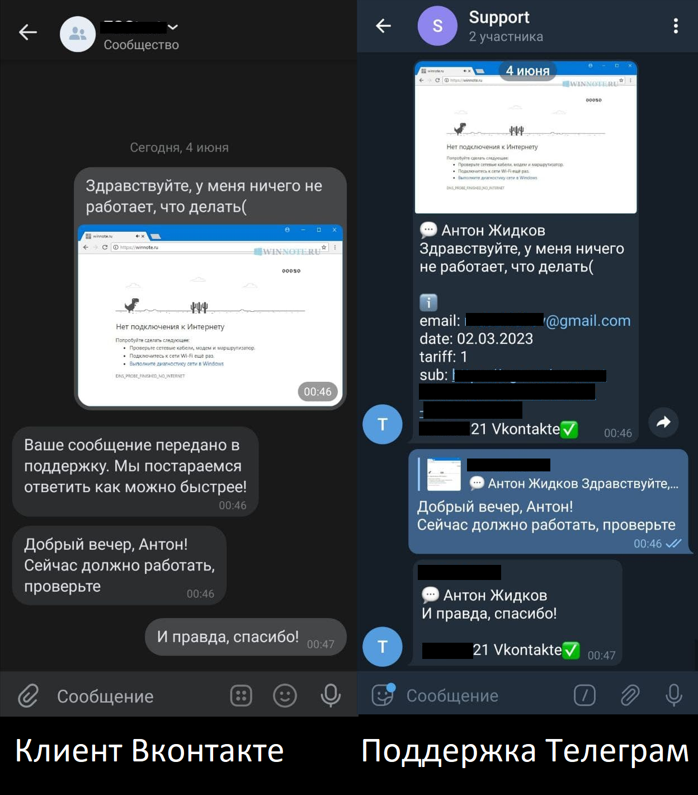
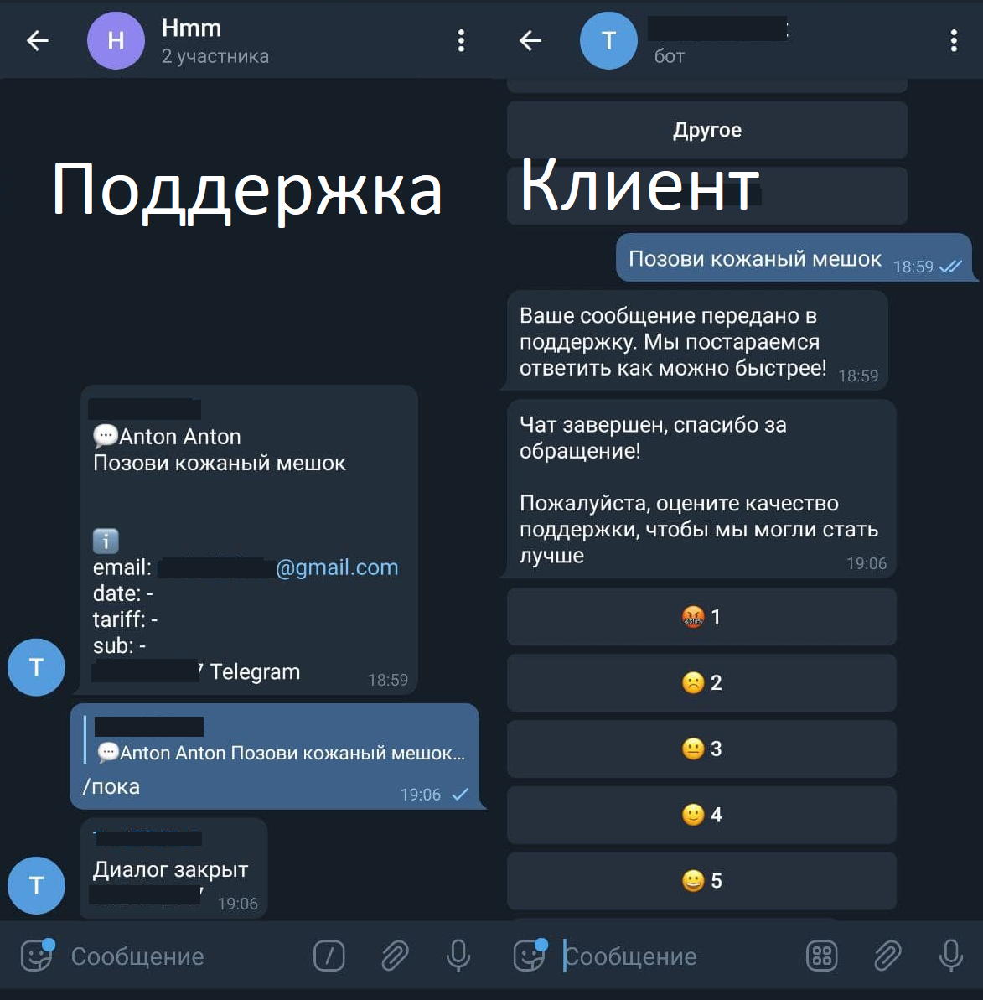
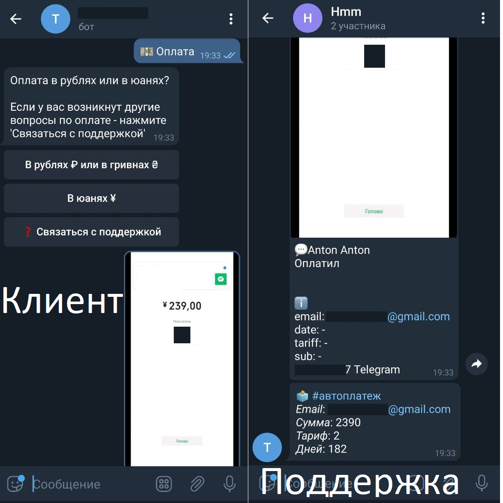

# Бот для обратной связи
Позволяет операторам технической поддержки отвечать на сообщения пользователей, приходящие во все три мессенджера: **Telegram**, **Vkontakte**, **Facebook**.

### Принцип работы обратной связи:
1. Клиент пишет вопрос в вашу группу вконтакте\фейсбуке\телеграм боту
2. Бот копирует сообщение клиента и отправляет в телеграм-чат, в котором находятся операторы тех. поддержки
3. Оператор отвечает на конкретное сообщение клиента
4. Бот пересылает ответ в тот мессенджер, из которого пришло сообщение, получившее ответ

Сообщения клиента пересылаются в группу только в том случае, если бот его идентифицировал, и если диалог с клиентом открыт. Для пользователей, впервые пишущих боту, взаимодействие с ним происходит следующим образом:
1. Клиент пишет в любой мессенджер, в ответ бот просит клиента прислать свою почту.

2. Бот заносит в базу данных айди клиента. На данном этапе диалог с клиентом закрыт. Для того, чтобы открыть диалог, клиенту нужно выбрать **'Связаться с поддержкой'** или **'Оплата'**.

3. После того, как проблема решена, оператор может закрыть диалог с клиентом командой **'/пока'**. Клиенту будет отправлено сообщение с просьбой оценить работу поддержки.

### Автооплата
В боте предусмотрена автоматическая обработка скриншотов оплаты с помощью бесплатного OCR-сервиса [OCRSpace](http://ocr.space). Если клиент откроет диалог с помощью кнопки **'Оплата'**, следующее присланное им фото будет проверено на наличие числа, соответствующего одному из тарифов. В случае нахождения соответствия будет автоматически зачтена оплата, а в чат операторов отправится информационное сообщение.

На данный момент автооплата доступна только для сообщений из телеграма и только для скриншотов с ценами в юанях.

### Напоминания
Бот автоматически напоминает клиентам с истекающей подпиской о своевременной оплате. Напоминание происходит за 3 дня, за 1 день, и в поледний день срока действия подписки в 13:00.

### Открытые диалоги
Для удобства работы операторов в чате поддержки висит закрепленное сообщение, содержащее информацию об открытых диалогах и о клиентах, которым бот недавно отправил напоминание об оплате. Сообщение автоматиески редактируется каждый раз при открытии\закрытии диалога и при рассылке напоминаний.

### Рассылка
Владельцу бота доступна возможность массовой рассылки по клиентам с выбранными тарифами. Для этого нужно написать боту команду **'/рассылка'**

### Изменение записей в базе данных
Владельцу бота также доступна возможность изменения записей в базе данных через бота. Работает так же как и рассылка, через ответы на сообщения. Для запуска нужно написать команду **'/почта'**

### Типы доступных для пересылки сообщений:
1. Из Телеграма в поддержку и из поддержки в Телеграм:
   text, photo, video, documents, voice, audio, sticker
2. Из Вконтакте в поддержку:
   text, photo    
3. Из поддержки в Вконтакте:
   text, photo, document
4. Из Фейсбука в поддержку:
   text, photo   
5. Из поддержки в Фейсбук:
   text

### База данных
Информация по всем клиентам, тарифам и подпискам хранится в базе данных **clients.db**. Каждые 15 минут файл обновляется данными, полученными из google sheets.
